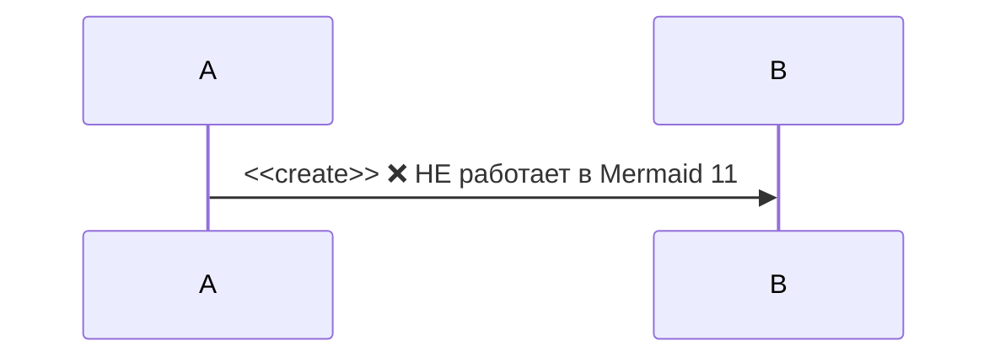
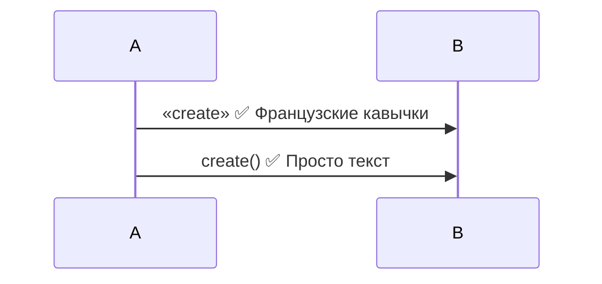
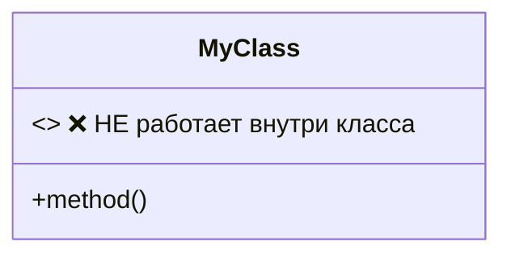
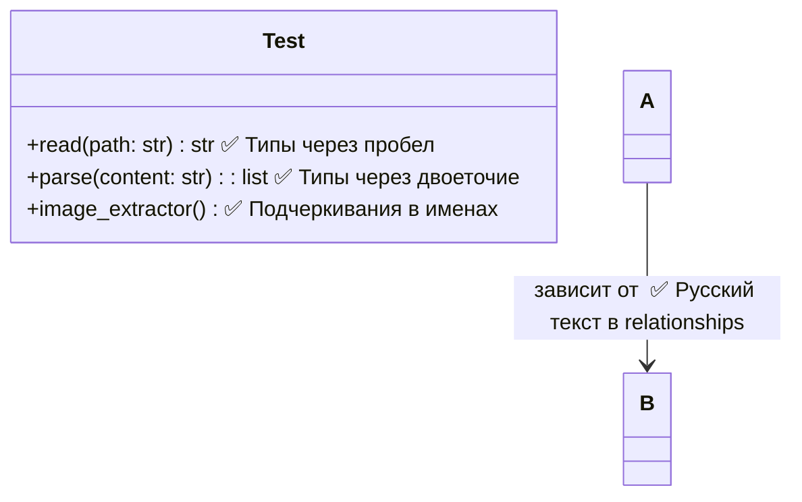

# Правила написания Mermaid диаграмм для AI-писателя

## ⚠️ КРИТИЧЕСКИ ВАЖНО

Конвертер **автоматически исправляет** типичные ошибки, но лучше писать правильно сразу.

---

## sequenceDiagram

### ❌ ЗАПРЕЩЕНО



### ✅ ПРАВИЛЬНО



### ⚠️ ВАЖНО: activate/deactivate

```mermaid
sequenceDiagram
    activate Repo
    Repo-->>Service: result
    deactivate Repo  ✅ Тот же участник!
    
    # НЕ ТАК:
    activate Repo
    deactivate Ord   ❌ ОШИБКА! Кто активирован, тот и деактивируется
```

**Автоисправление:** конвертер АВТОМАТИЧЕСКИ исправит неправильный `deactivate`

---

## classDiagram

### ❌ ЗАПРЕЩЕНО



### ✅ ПРАВИЛЬНО

```mermaid
classDiagram
    class MyClass {
        +method()
    }
    
    note for MyClass "Это интерфейс"  ✅ Используй note вместо стереотипа
```

**Автоисправление:** конвертер АВТОМАТИЧЕСКИ удалит `<<interface>>`, `<<abstract>>` из тела классов

### ✅ РАБОТАЕТ (без изменений)



### ⚠️ ОСТОРОЖНО

```mermaid
classDiagram
    note for Handler "🎯 Эмодзи"  ⚠️ Может не рендериться
    note for Handler "Текст\nна две строки"  ⚠️ Многострочный текст
```

---

## 🤖 Что делает автоисправление

1. **sequenceDiagram:**
   - `<< >>` → `« »` в message labels
   - Исправляет неправильные `deactivate` (по стеку activate)

2. **classDiagram:**
   - Удаляет `<<interface>>`, `<<abstract>>` и другие стереотипы из тела классов

3. **Все типы:**
   - НЕ трогает участников с алиасами: `participant Service as OrderService`
   - НЕ трогает типы возврата: `+method() str`
   - НЕ трогает русский текст

---

## 📝 Шаблон промпта для AI

```
При создании Mermaid диаграмм:

1. sequenceDiagram:
   - НЕ используй << >> в message labels (используй « » или просто текст)
   - Строго соблюдай парность activate/deactivate (кто активирован, тот и деактивируется)

2. classDiagram:
   - НЕ используй <<interface>>, <<abstract>> внутри class body
   - Если нужно показать тип класса, используй note
   - Типы через пробел работают: +method(param: str) str

3. Общее:
   - Русский текст разрешен везде
   - Подчеркивания в именах разрешены
   - Избегай эмодзи в критичных местах
```

---

## 🔍 Диагностика проблем

Если диаграмма не рендерится:

1. Проверь консоль браузера (F12) - там будет "Syntax error in text"
2. Открой сгенерированный HTML, найди `<div class="mermaid">`
3. Скопируй код диаграммы в <https://mermaid.live/>
4. Проверь, что автоисправление сработало (смотри логи конвертации)

**Автоисправление показывает в логах:**

```
⚠️  Mermaid auto-fix: deactivate Ord → Repo
🔧 Mermaid auto-fix: sequenceDiagram: << >> → « »
⚠️  Mermaid auto-fix: удалены стереотипы <<interface>> из classDiagram
```
