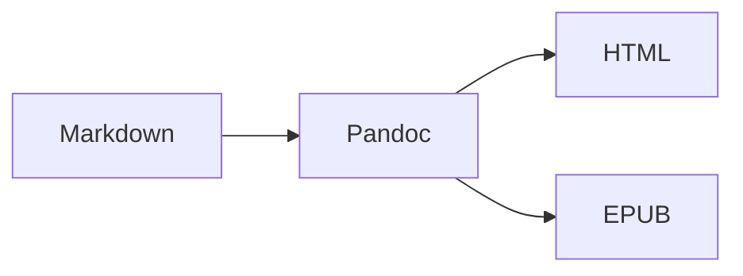

# 📚 MD-to-HTML Book Builder

Конвертер Markdown в HTML и EPUB с профессиональным оформлением.

## ✨ Основные возможности

### HTML версия

- 🎨 **GitHub Dark подсветка кода** (Highlight.js)
- 📊 **Mermaid диаграммы** (интерактивные SVG)
- 📋 **Копирование кода** (кнопки на блоках)
- 🔍 **Fullscreen режим** (для изображений и диаграмм)
- 🎯 **Красивое оглавление** (градиентный фиолетовый фон)
- 📄 **Один файл** (всё встроено внутрь)

### EPUB версия

- 🎨 **Кастомная тема подсветки** (github-dark.theme)
- 📊 **Mermaid диаграммы** (векторные SVG)
- 🔤 **Вшитые шрифты** (JetBrains Mono, NotoEmoji)
- 📱 **Адаптивные стили** (для e-readers)
- 📖 **Оглавление** (навигация по книге)

## 🚀 Быстрый старт

```powershell
# 1. Установить зависимости (см. INSTALL.md)
pandoc --version  # >= 3.0
npm --version     # >= 9.0

# 2. Установить mermaid-filter
npm install --global mermaid-filter

# 3. Установить Python пакеты
poetry install

# 4. Запустить сборку
poetry run python build_book.py
```

## 📦 Требования

- **Pandoc 3.x** - <https://pandoc.org/>
- **Node.js 16+** - <https://nodejs.org/>
- **Python 3.9+** - <https://python.org/>
- **mermaid-filter** - `npm install -g mermaid-filter`

Подробная инструкция: [doc/INSTALL.md](doc/INSTALL.md)

## 📖 Использование

### Интерактивный режим

```powershell
poetry run python build_book.py
```

### Программный вызов

```python
from build_book import build_book

# Сборка HTML
build_book("input.md", "output_name", "html")

# Сборка EPUB
build_book("input.md", "output_name", "epub")

# Папка с файлами
build_book("markdown_folder/", "book_name", "html")
```

## 📁 Пример структуры Markdown

```
my_book/
├── 01_introduction.md
├── 02_chapter_one.md
├── 03_chapter_two.md
└── 10_conclusion.md
```

Файлы сортируются естественным образом (1, 2, 10... а не 1, 10, 2...)

## 🎨 Markdown возможности

### Код с подсветкой

```python
def hello():
    print("Hello, World!")
```

### Mermaid диаграммы



### Таблицы

| Заголовок | Описание |
|-----------|----------|
| HTML      | Веб-версия |
| EPUB      | Для читалок |

### Цитаты
>
> Это красивая цитата с золотистой линией слева

## 🛠️ Конфигурация

Настройки в [build_book.py](build_book.py):

```python
# Темы подсветки
HLJS_THEME = "github-dark"        # HTML
CUSTOM_THEME_FILE = "assets/github-dark.theme"  # EPUB

# Mermaid
MERMAID_THEME = "neutral"         # neutral, default, dark, forest
MERMAID_FORMAT = "svg"            # svg (лучше) или png

# Шрифты
EMBED_FONTS_IN_EPUB = True        # Вшивать шрифты в EPUB
```

## 📚 Документация

- [doc/INSTALL.md](doc/INSTALL.md) - Подробная установка
- [doc/JS_ENHANCEMENTS.md](doc/JS_ENHANCEMENTS.md) - JavaScript возможности
- [doc/FONT_LICENSES.md](doc/FONT_LICENSES.md) - Лицензии на шрифты
- [doc/dif_logic.md](doc/dif_logic.md) - Логика работы

## 🎯 Примеры

### HTML с интерактивом

- Клик по коду → кнопка копирования
- Клик по изображению → fullscreen
- Клик по диаграмме → fullscreen
- Плавная прокрутка оглавления

### EPUB для читалки

- Векторные диаграммы (четкие на любом zoom)
- Встроенные шрифты (работают на PocketBook)
- Правильная навигация
- Адаптивное оформление

## 🔧 Кастомизация

### Изменить стили

Редактируй [assets/css/book_style.css](assets/css/book_style.css)

### Добавить JS функции

Редактируй [assets/js/pandoc_enhancements.js](assets/js/pandoc_enhancements.js)

### Изменить тему подсветки

```powershell
# Экспортировать тему Pandoc
pandoc --print-highlight-style breezedark > my_theme.theme

# Отредактировать JSON файл
code my_theme.theme

# Использовать в build_book.py
CUSTOM_THEME_FILE = "my_theme.theme"
```

## 📊 Результат сборки

```
build/
├── my_book.html           # HTML версия (один файл, всё встроено)
└── my_book.epub           # EPUB версия (для e-readers)
```

### HTML (один файл)

- CSS встроен
- JavaScript встроен
- Изображения встроены (base64)
- Можно открыть где угодно

### EPUB (стандартный формат)

- Совместим с Kindle, PocketBook, Kobo
- Шрифты внутри
- SVG диаграммы
- Навигация по главам

## 🤝 Вклад

Pull requests приветствуются!

1. Fork репозитория
2. Создай feature branch (`git checkout -b feature/amazing`)
3. Commit изменений (`git commit -m 'Add amazing feature'`)
4. Push в branch (`git push origin feature/amazing`)
5. Открой Pull Request

## 📄 Лицензия

MIT License - см. [LICENSE](LICENSE)

### Лицензии шрифтов

Все используемые шрифты распространяются под **SIL Open Font License 1.1**:

- ✅ **JetBrains Mono** - для кода
- ✅ **FiraCode** - для кода
- ✅ **Cascadia Code** - для кода
- ✅ **Merriweather** - для текста (serif)
- ✅ **Montserrat** - для заголовков (sans-serif)
- ✅ **Noto Emoji** - для emoji

Подробности: [doc/FONT_LICENSES.md](doc/FONT_LICENSES.md)

**SIL OFL 1.1** разрешает:
- Использование в коммерческих проектах
- Встраивание в документы (HTML/EPUB/PDF)
- Модификацию и распространение

## 👤 Автор

**Vladimir Monin**

- GitHub: [@VladimirMonin](https://github.com/VladimirMonin)

## 🙏 Благодарности

- [Pandoc](https://pandoc.org/) - универсальный конвертер
- [Highlight.js](https://highlightjs.org/) - подсветка синтаксиса
- [Mermaid](https://mermaid.js.org/) - диаграммы
- [mermaid-filter](https://github.com/raghur/mermaid-filter) - Pandoc filter для Mermaid
