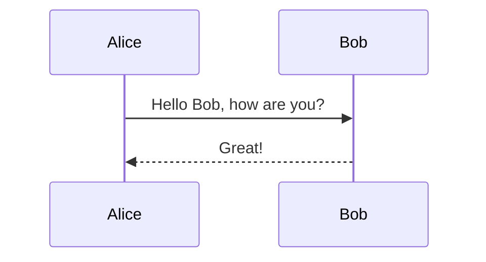

# MD to HTML Конвертер

[](https://python.org)
[](https://daringfireball.net/projects/markdown/)
[](https://getbootstrap.com/)
[](LICENSE)

## 📝 Обзор

MD to HTML — это мощный инструмент для преобразования Markdown-документов в красиво оформленные HTML-страницы с современным дизайном и интерактивными элементами. Программа автоматически создает профессиональные веб-страницы с адаптивным дизайном, подсветкой синтаксиса и эффектными визуальными элементами.

## ✨ Ключевые преимущества

- **🚀 Быстрая конвертация** — преобразование больших документов за секунды
- **🎨 Современный дизайн** — красивый интерфейс без дополнительной настройки
- **📱 Адаптивность** — идеальное отображение на всех устройствах
- **🔧 Расширяемость** — легко настраиваемые стили и функциональность
- **📊 Диаграммы** — поддержка визуализации данных через Mermaid.js
- **🎯 Простота использования** — минимальная настройка, максимальный результат

## Особенности

- **Современный дизайн** с использованием Bootstrap 5
- **Автоматическое оглавление** с подсветкой текущего раздела при прокрутке
- **Параллакс-эффект** с плавающими тематическими иконками
- **Подсветка синтаксиса** для кода с помощью highlight.js
- **Кнопки копирования кода** с анимацией
- **Полноэкранный просмотр изображений** по клику
- **Специальные блоки уведомлений** различных типов
- **Поддержка диаграмм Mermaid** для визуализации данных
- **Отображение сравнения кода (Diff)** для отслеживания изменений
- **Встроенный видеоплеер** с поддержкой HTML5 видео
- **Адаптивный дизайн** для всех устройств

## 📁 Структура проекта

```text
MD_to_HTML/
├── assets/
│   ├── css/
│   │   ├── default.css       # Основные стили
│   │   └── parallax.css      # Стили для параллакс-эффекта
│   ├── js/
│   │   ├── codeCopy.js       # Функционал копирования кода
│   │   ├── main.js           # Основной JavaScript
│   │   ├── media.js          # Обработка медиа-контента
│   │   ├── menu.js           # Генерация оглавления
│   │   └── parallax.js       # Эффект параллакса
│   └── img/                  # Директория для изображений (опционально)
├── main.html                 # Шаблон HTML
└── .gitignore                # Игнорируемые файлы
```

## 🚀 Быстрый старт

### Установка

1. **Клонируйте репозиторий:**

   ```bash
   git clone <repository-url>
   cd MD_to_HTML
   ```

2. **Установите зависимости с помощью Poetry:**

   ```bash
   poetry install
   ```

   Или используйте pip:

   ```bash
   pip install -r requirements.txt
   ```

### Использование

1. **Запустите программу:**

   ```bash
   python main.py
   ```

2. **Введите путь** к файлу или папке с Markdown-файлами в интерактивном режиме.

3. **Получите результат** в папке `./result/` с готовыми HTML-страницами.

### Пример команды

```bash
# Конвертация одного файла
python main.py
# Введите: C:\path\to\your\document.md

# Конвертация всех файлов в папке
python main.py  
# Введите: C:\path\to\markdown\folder
```

## 📋 Примеры использования

### Базовая конвертация

```bash
# Конвертация одного файла
python main.py
# Введите путь: C:\Documents\my-document.md
```

### Пакетная обработка

```bash
# Конвертация всех файлов в папке
python main.py
# Введите путь: C:\Documents\markdown-files\
```

### Результат работы

После успешной конвертации в папке `result/` создается:

- Папка с именем исходного файла
- HTML-файл с тем же именем
- Папка `assets/` со стилями и скриптами
- Папка `media/` с изображениями (если есть)

**Пример структуры результата:**

```text
result/
└── my-document/
    ├── my-document.html
    ├── assets/
    │   ├── css/
    │   └── js/
    └── media/
        └── image1.jpg
```

## 🔧 Устранение проблем

### Частые ошибки

**Ошибка кодировки при чтении файла:**

```text
UnicodeDecodeError: 'charmap' codec can't decode
```

*Решение:* Убедитесь, что ваши Markdown-файлы сохранены в кодировке UTF-8.

**Файлы изображений не найдены:**

```text
FileNotFoundError: [Errno 2] No such file or directory: 'image.jpg'
```

*Решение:* Проверьте корректность путей к изображениям в Markdown-файле.

**Диаграммы Mermaid не отображаются:**
*Решение:* Используйте только поддерживаемые типы диаграмм (см. раздел "Диаграммы Mermaid").

### Диагностика

Для диагностики проблем запустите с подробным выводом:

```bash
python main.py
```

Программа выведет информацию о:

- Обрабатываемых файлах
- Копируемых медиафайлах
- Возможных ошибках конвертации

## 💡 Советы по использованию

### Оптимизация изображений

- Используйте изображения разумного размера (до 2MB)
- Форматы JPG, PNG, WebP работают лучше всего
- Относительные пути предпочтительнее абсолютных

### Структура документов

- Используйте заголовки разных уровней для автооглавления
- Разбивайте длинные документы на логические разделы
- Добавляйте описательные alt-тексты к изображениям

### Работа с кодом

- Указывайте язык для блоков кода для корректной подсветки
- Используйте короткие примеры кода для лучшей читаемости
- Блоки diff особенно полезны для показа изменений

## ⚙️ Как работает конвертация

Программа работает на основе шаблона `main.html`, в который подставляется преобразованный Markdown-контент. Для корректной работы в шаблоне используются следующие переменные:

- `{{ content }}` — основное содержимое HTML
- `{title}` — заголовок страницы
- `{header}` — заголовок документа
- `{brand}` — путь к изображению брендинга

### Этапы конвертации

1. **Чтение** Markdown-файла в кодировке UTF-8
2. **Обработка медиафайлов** — копирование изображений в папку `media/`
3. **Преобразование** с использованием расширений Python-Markdown
4. **Генерация HTML** на основе шаблона
5. **Копирование assets** (стили, скрипты) в целевую папку

## 🔧 Конфигурация

### Основные настройки

В файле `main.py` можно изменить следующие параметры:

```python
TEMPLATE = "main.html"              # Шаблон HTML
RESULT_FOLDER = "./result"          # Папка для результатов
BRAND_IMAGE = r"covers\logo.jpg"    # Изображение брендинга
```

### Настройка расширений Markdown

Программа использует следующие расширения:

- `extra` — дополнительные возможности синтаксиса
- `tables` — поддержка таблиц
- `fenced_code` — блоки кода с подсветкой
- `pymdownx.superfences` — расширенные блоки кода
- `DiffExtension` — кастомное расширение для diff

### Поддерживаемые диаграммы Mermaid

⚠️ **Экспериментальный режим** — поддерживаются только следующие типы диаграмм:

- **Диаграммы классов** (Class diagrams)
- **Диаграммы последовательности** (Sequence diagrams)  
- **Диаграммы Ганта** (Gantt charts)
- **Ментальные карты** (Mind maps)

*Остальные типы диаграмм могут работать некорректно.*

**Пример диаграммы последовательности:**

````markdown

````

## 🚀 Производительность

### Рекомендации по размеру файлов

- **Markdown-файлы**: до 10MB
- **Изображения**: до 2MB каждое
- **Общий размер проекта**: до 100MB

### Оптимизация

- Используйте сжатые изображения
- Избегайте слишком сложных диаграмм Mermaid
- Разбивайте большие документы на части

## 📄 Лицензия

Этот проект распространяется под лицензией MIT. Подробности в файле [LICENSE](LICENSE).

## 🤝 Вклад в проект

Мы приветствуем вклад в развитие проекта! Если у вас есть идеи по улучшению или вы нашли ошибку:

1. Создайте Issue с описанием проблемы или предложения
2. Сделайте Fork репозитория
3. Создайте ветку для ваших изменений
4. Отправьте Pull Request

## 📞 Поддержка

Если у вас возникли вопросы или проблемы:

- Создайте Issue в репозитории
- Проверьте раздел "Устранение проблем"
- Убедитесь, что используете последнюю версию

---

Создано с ❤️ для удобной работы с Markdown документами
