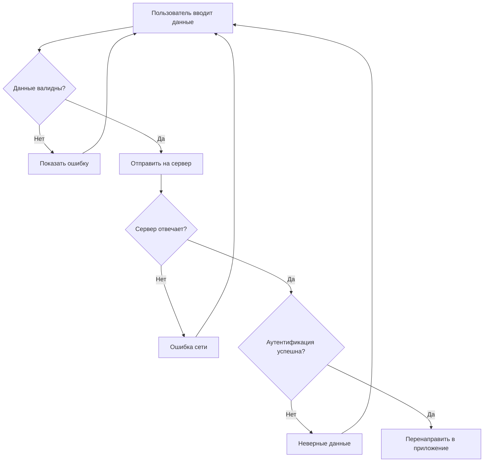
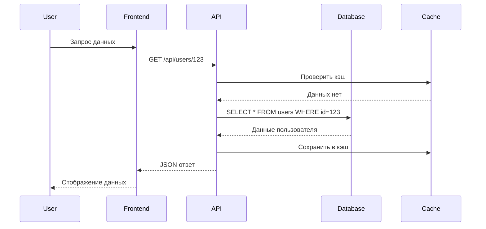
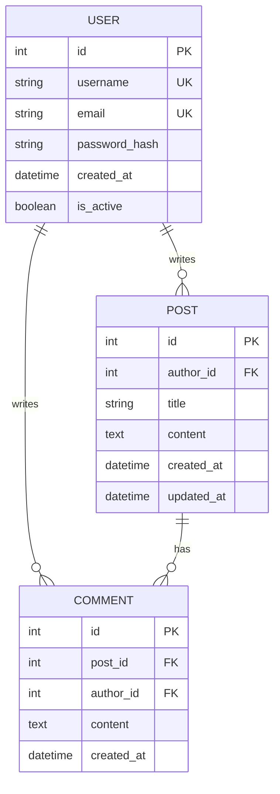

# 🎨 Демо всех стилей и компонентов

Этот файл содержит примеры всех доступных элементов оформления.

## 🏷️ Основные заголовки

# H1 - Главный заголовок

## H2 - Заголовок раздела  

### H3 - Подраздел

#### H4 - Подподраздел

##### H5 - Мелкий заголовок

###### H6 - Самый мелкий заголовок

---

## 📢 Все типы уведомлений

> [!info]
> Информационное сообщение с полезными данными

> [!warning]  
> Предупреждение о возможных проблемах

> [!success]
> Сообщение об успешном выполнении операции

> [!error]
> Сообщение об ошибке или критической проблеме

> [!tip]
> Полезный совет или рекомендация

> [!highlight]
> Выделение важной информации

> [!danger]
> Предупреждение об опасности

---

## 💾 Примеры кода разных языков

### Python

```python
class DataProcessor:
    def __init__(self, data_source):
        self.data_source = data_source
        self.processed_data = []
    
    def process(self):
        """Обрабатывает данные из источника"""
        for item in self.data_source:
            processed_item = self._transform(item)
            self.processed_data.append(processed_item)
        return self.processed_data
    
    def _transform(self, item):
        return item.upper().strip()
```

### JavaScript

```javascript
const apiClient = {
    baseURL: 'https://api.example.com',
    
    async get(endpoint) {
        const response = await fetch(`${this.baseURL}${endpoint}`);
        if (!response.ok) {
            throw new Error(`HTTP ${response.status}: ${response.statusText}`);
        }
        return response.json();
    },
    
    async post(endpoint, data) {
        const response = await fetch(`${this.baseURL}${endpoint}`, {
            method: 'POST',
            headers: {'Content-Type': 'application/json'},
            body: JSON.stringify(data)
        });
        return response.json();
    }
};
```

### CSS

```css
/* Современные CSS переменные и flexbox */
:root {
    --primary-color: #3498db;
    --secondary-color: #2ecc71;
    --danger-color: #e74c3c;
    --border-radius: 8px;
}

.card {
    display: flex;
    flex-direction: column;
    background: white;
    border-radius: var(--border-radius);
    box-shadow: 0 4px 6px rgba(0, 0, 0, 0.1);
    transition: transform 0.3s ease;
}

.card:hover {
    transform: translateY(-2px);
    box-shadow: 0 8px 25px rgba(0, 0, 0, 0.15);
}
```

### SQL

```sql
-- Комплексный запрос с CTE и оконными функциями
WITH monthly_sales AS (
    SELECT 
        DATE_TRUNC('month', order_date) as month,
        SUM(total_amount) as monthly_total,
        COUNT(*) as order_count
    FROM orders 
    WHERE order_date >= '2024-01-01'
    GROUP BY DATE_TRUNC('month', order_date)
),
ranked_months AS (
    SELECT 
        month,
        monthly_total,
        order_count,
        ROW_NUMBER() OVER (ORDER BY monthly_total DESC) as rank
    FROM monthly_sales
)
SELECT * FROM ranked_months WHERE rank <= 5;
```

---

## 🔄 Diff примеры

### Рефакторинг Python кода

```diff-python
class User:
    def __init__(self, name, email):
-        self.name = name
-        self.email = email
+        self.name = name.strip().title()
+        self.email = email.lower().strip()
+        self._validate_email()
    
+    def _validate_email(self):
+        import re
+        pattern = r'^[a-zA-Z0-9._%+-]+@[a-zA-Z0-9.-]+\.[a-zA-Z]{2,}$'
+        if not re.match(pattern, self.email):
+            raise ValueError("Некорректный email адрес")
```

### Обновление React компонента

```diff-javascript
-function UserProfile({ user }) {
-    return (
-        <div>
-            <h2>{user.name}</h2>
-            <p>{user.email}</p>
-        </div>
-    );
-}
+function UserProfile({ user, onEdit }) {
+    const [isEditing, setIsEditing] = useState(false);
+    
+    return (
+        <div className="user-profile">
+            {isEditing ? (
+                <UserEditForm 
+                    user={user} 
+                    onSave={onEdit}
+                    onCancel={() => setIsEditing(false)}
+                />
+            ) : (
+                <UserDisplayView 
+                    user={user}
+                    onEditClick={() => setIsEditing(true)}
+                />
+            )}
+        </div>
+    );
+}
```

---

## 📊 Диаграммы Mermaid

### Flowchart - Процесс аутентификации



### Sequence диаграмма - API взаимодействие



### Entity Relationship диаграмма



---

## 📋 Списки и таблицы

### Простой список

- Первый элемент
- Второй элемент  
- Третий элемент

### Вложенный список

1. **Фронтенд разработка**
   - HTML/CSS
   - JavaScript
   - React/Vue/Angular

2. **Бэкенд разработка**
   - Python/Django
   - Node.js/Express
   - Базы данных

3. **DevOps**
   - Docker
   - CI/CD
   - Мониторинг

### Чек-лист

- [x] Завершена базовая функциональность
- [x] Написаны unit тесты
- [ ] Проведено нагрузочное тестирование
- [ ] Создана документация
- [ ] Настроен мониторинг

### Таблица технологий

| Технология | Тип | Сложность | Рейтинг |
|------------|-----|-----------|---------|
| **HTML** | Markup | Легкая | ⭐⭐⭐⭐⭐ |
| **CSS** | Styling | Средняя | ⭐⭐⭐⭐ |
| **JavaScript** | Programming | Средняя | ⭐⭐⭐⭐⭐ |
| **Python** | Programming | Легкая | ⭐⭐⭐⭐⭐ |
| **React** | Framework | Сложная | ⭐⭐⭐⭐ |

---

## 🎯 Специальные элементы

### Цитаты

> "Любой дурак может написать код, который поймёт компьютер. Хорошие программисты пишут код, который понимают люди."
>
> — Martin Fowler

### Клавиатурные сочетания

- <kbd>Ctrl</kbd> + <kbd>S</kbd> - Сохранить
- <kbd>Ctrl</kbd> + <kbd>Z</kbd> - Отменить  
- <kbd>Ctrl</kbd> + <kbd>Shift</kbd> + <kbd>P</kbd> - Командная палитра

### Встроенный код

Используйте функцию `console.log()` для отладки JavaScript кода.

### Ссылки

- [MDN Web Docs](https://developer.mozilla.org/)
- [Python.org](https://python.org/)
- [GitHub](https://github.com/)

### Эмодзи

🚀 Запуск • 🔧 Настройка • 📊 Аналитика • 🎨 Дизайн • 🔒 Безопасность

---

## 📸 Изображения


---

## ✅ Заключение

Этот файл демонстрирует:

- ✨ Все типы заголовков
- 🔔 Все виды уведомлений  
- 💻 Подсветку кода для разных языков
- 🔄 Diff-блоки для сравнения
- 📊 Различные диаграммы Mermaid
- 📋 Списки, таблицы и специальные элементы
- 🎯 Дополнительные возможности форматирования

> [!tip]
> Используйте этот файл как справочник по всем доступным возможностям оформления!
