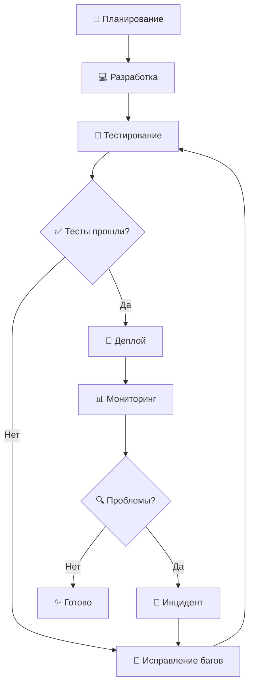
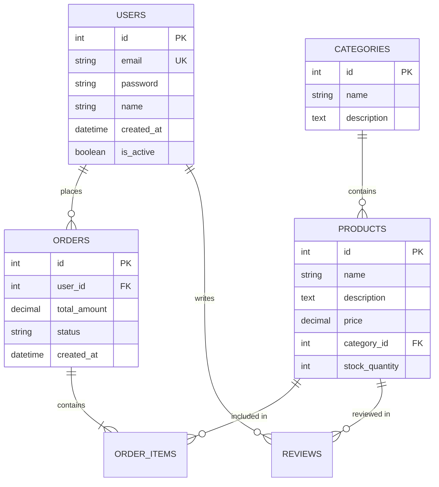
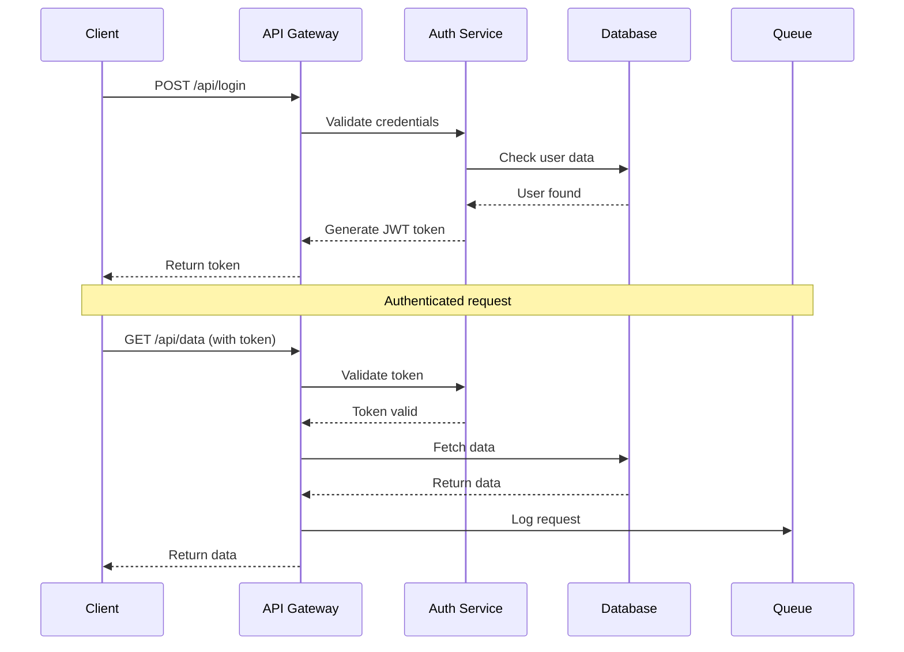
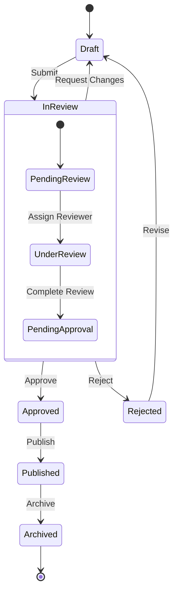
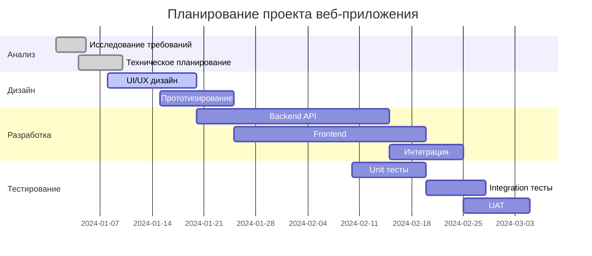

# 🚀 Полное демо возможностей MD to HTML конвертера

Этот документ демонстрирует все доступные функции и стили конвертера Markdown в HTML.

---

## 📋 Содержание

1. [Заголовки и форматирование](#заголовки-и-форматирование)
2. [Блоки уведомлений](#блоки-уведомлений)
3. [Блоки кода](#блоки-кода)
4. [Diff-блоки](#diff-блоки)
5. [Диаграммы Mermaid](#диаграммы-mermaid)
6. [Списки и таблицы](#списки-и-таблицы)
7. [Медиа-контент](#медиа-контент)
8. [Специальное форматирование](#специальное-форматирование)

---

## 📝 Заголовки и форматирование

### Подзаголовок уровня 3

#### Подзаголовок уровня 4

##### Подзаголовок уровня 5

###### Подзаголовок уровня 6

**Жирный текст**, *курсив*, ~~зачёркнутый~~, `код в строке`

Горизонтальный разделитель:

---

## 🔔 Блоки уведомлений

> [!info]
> **Информационный блок**
>
> Этот блок содержит полезную информацию для пользователя. Он может содержать несколько строк текста и даже `код`.

> [!warning]
> **Предупреждение**
>
> Будьте осторожны! Эта операция может привести к потере данных.

> [!success]
> **Успешное выполнение**
>
> ✅ Операция завершена успешно! Все изменения сохранены.

> [!error]
> **Ошибка**
>
> ❌ Произошла критическая ошибка. Проверьте логи для получения подробной информации.

> [!tip]
> **Полезный совет**
>
> 💡 Используйте сочетание клавиш `Ctrl+S` для быстрого сохранения файла.

> [!highlight]
> **Важная информация**
>
> 🔥 Эта функция является экспериментальной и может измениться в будущих версиях.

> [!danger]
> **Опасность**
>
> ⚠️ Не выполняйте эту команду на продакшн-сервере без предварительного резервного копирования!

---

## 💻 Блоки кода

### Python код

```python
def fibonacci(n):
    """Генерирует последовательность Фибоначчи до n элементов."""
    if n <= 0:
        return []
    elif n == 1:
        return [0]
    elif n == 2:
        return [0, 1]
    
    fib_sequence = [0, 1]
    for i in range(2, n):
        fib_sequence.append(fib_sequence[i-1] + fib_sequence[i-2])
    
    return fib_sequence

# Пример использования
result = fibonacci(10)
print(f"Первые 10 чисел Фибоначчи: {result}")
```

### JavaScript код

```javascript
// Современный JavaScript с async/await
async function fetchUserData(userId) {
    try {
        const response = await fetch(`/api/users/${userId}`);
        const userData = await response.json();
        
        if (!response.ok) {
            throw new Error(`HTTP error! status: ${response.status}`);
        }
        
        return userData;
    } catch (error) {
        console.error('Ошибка при получении данных пользователя:', error);
        throw error;
    }
}

// Стрелочная функция с деструктуризацией
const processUserData = ({name, email, age}) => {
    return {
        displayName: name.toUpperCase(),
        emailDomain: email.split('@')[1],
        isAdult: age >= 18
    };
};
```

### HTML/CSS код

```html
<!DOCTYPE html>
<html lang="ru">
<head>
    <meta charset="UTF-8">
    <meta name="viewport" content="width=device-width, initial-scale=1.0">
    <title>Пример страницы</title>
    <style>
        .container {
            max-width: 1200px;
            margin: 0 auto;
            padding: 20px;
        }
        
        .card {
            background: linear-gradient(135deg, #667eea 0%, #764ba2 100%);
            border-radius: 15px;
            padding: 30px;
            color: white;
            box-shadow: 0 10px 30px rgba(0,0,0,0.3);
        }
    </style>
</head>
<body>
    <div class="container">
        <div class="card">
            <h1>Добро пожаловать!</h1>
            <p>Это демонстрация HTML/CSS кода.</p>
        </div>
    </div>
</body>
</html>
```

### SQL запрос

```sql
-- Сложный запрос с JOIN и агрегацией
SELECT 
    u.id,
    u.name,
    u.email,
    COUNT(o.id) as total_orders,
    SUM(o.amount) as total_spent,
    MAX(o.created_at) as last_order_date,
    CASE 
        WHEN SUM(o.amount) > 1000 THEN 'VIP'
        WHEN SUM(o.amount) > 500 THEN 'Premium'
        ELSE 'Regular'
    END as customer_tier
FROM users u
LEFT JOIN orders o ON u.id = o.user_id
WHERE u.is_active = TRUE
    AND u.created_at >= '2023-01-01'
GROUP BY u.id, u.name, u.email
HAVING COUNT(o.id) > 0
ORDER BY total_spent DESC, last_order_date DESC
LIMIT 100;
```

### Bash скрипт

```bash
#!/bin/bash

# Скрипт для автоматического развертывания приложения
set -e

PROJECT_NAME="my-app"
DEPLOY_DIR="/var/www/${PROJECT_NAME}"
BACKUP_DIR="/var/backups/${PROJECT_NAME}"

echo "🚀 Начинаем развертывание ${PROJECT_NAME}..."

# Создание резервной копии
if [ -d "$DEPLOY_DIR" ]; then
    echo "📦 Создание резервной копии..."
    sudo cp -r "$DEPLOY_DIR" "$BACKUP_DIR/$(date +%Y%m%d_%H%M%S)"
fi

# Обновление кода
echo "⬇️ Загрузка последней версии..."
git pull origin main

# Установка зависимостей
echo "📚 Установка зависимостей..."
npm ci --production

# Сборка проекта
echo "🔨 Сборка проекта..."
npm run build

# Перезапуск сервиса
echo "🔄 Перезапуск сервиса..."
sudo systemctl restart ${PROJECT_NAME}

echo "✅ Развертывание завершено успешно!"
```

---

## 🔄 Diff-блоки

### Обновление Python функции

```diff-python
def calculate_discount(price, discount_percent):
-    # Простое вычисление скидки
-    return price * (discount_percent / 100)
+    # Улучшенное вычисление с валидацией
+    if not isinstance(price, (int, float)) or price < 0:
+        raise ValueError("Цена должна быть положительным числом")
+    
+    if not isinstance(discount_percent, (int, float)) or not 0 <= discount_percent <= 100:
+        raise ValueError("Процент скидки должен быть от 0 до 100")
+    
+    discount_amount = price * (discount_percent / 100)
+    return round(discount_amount, 2)
```

### Рефакторинг JavaScript

```diff-javascript
// Замена fetch на axios с улучшенной обработкой ошибок
-async function getData(url) {
-    const response = await fetch(url);
-    return response.json();
-}
+async function getData(url, options = {}) {
+    try {
+        const response = await axios.get(url, {
+            timeout: 5000,
+            ...options
+        });
+        return response.data;
+    } catch (error) {
+        if (error.response) {
+            // Ошибка от сервера
+            throw new Error(`Ошибка ${error.response.status}: ${error.response.data.message}`);
+        } else if (error.request) {
+            // Нет ответа от сервера
+            throw new Error('Сервер недоступен');
+        } else {
+            // Другая ошибка
+            throw new Error(`Ошибка запроса: ${error.message}`);
+        }
+    }
+}
```

### Обновление CSS

```diff-css
.navbar {
-    background-color: #fff;
-    box-shadow: 0 2px 4px rgba(0,0,0,0.1);
+    background: linear-gradient(135deg, #667eea 0%, #764ba2 100%);
+    box-shadow: 0 4px 20px rgba(0,0,0,0.15);
+    backdrop-filter: blur(10px);
    padding: 1rem 0;
+    position: sticky;
+    top: 0;
+    z-index: 1000;
}

.navbar-brand {
-    color: #333;
+    color: white;
+    font-weight: 700;
+    text-shadow: 0 2px 4px rgba(0,0,0,0.3);
}
```

### Миграция базы данных

```diff-sql
-- Добавление новых полей в таблицу пользователей
ALTER TABLE users 
-ADD COLUMN created_at TIMESTAMP DEFAULT CURRENT_TIMESTAMP;
+ADD COLUMN created_at TIMESTAMP DEFAULT CURRENT_TIMESTAMP,
+ADD COLUMN updated_at TIMESTAMP DEFAULT CURRENT_TIMESTAMP ON UPDATE CURRENT_TIMESTAMP,
+ADD COLUMN last_login_at TIMESTAMP NULL,
+ADD COLUMN is_email_verified BOOLEAN DEFAULT FALSE,
+ADD COLUMN profile_image_url VARCHAR(255) NULL;

+-- Создание индексов для улучшения производительности
+CREATE INDEX idx_users_created_at ON users(created_at);
+CREATE INDEX idx_users_last_login ON users(last_login_at);
+CREATE INDEX idx_users_email_verified ON users(is_email_verified);
```

---

## 📊 Диаграммы Mermaid

### Схема процесса разработки



### ER-диаграмма базы данных



### Последовательная диаграмма API



### Диаграмма состояний



### Диаграмма Ганта



---

## 📝 Списки и таблицы

### Маркированный список

- 🏠 **Основные возможности:**
  - Конвертация Markdown в HTML
  - Современный дизайн с Bootstrap 5
  - Подсветка синтаксиса кода
  - Параллакс-эффекты
  
- 🔧 **Дополнительные функции:**
  - Автоматическое оглавление
  - Копирование кода одним кликом
  - Полноэкранный просмотр изображений
  - Поддержка видео

### Нумерованный список

1. **Подготовка проекта**
   1. Установка зависимостей
   2. Настройка конфигурации
   3. Создание структуры папок

2. **Разработка**
   1. Написание кода
   2. Создание тестов
   3. Документирование

3. **Тестирование и деплой**
   1. Локальное тестирование
   2. CI/CD пайплайн
   3. Продакшн деплой

### Таблица сравнения технологий

| Технология | Производительность | Простота изучения | Экосистема | Популярность |
|------------|-------------------|-------------------|------------|--------------|
| **React** | ⭐⭐⭐⭐ | ⭐⭐⭐ | ⭐⭐⭐⭐⭐ | ⭐⭐⭐⭐⭐ |
| **Vue.js** | ⭐⭐⭐⭐ | ⭐⭐⭐⭐⭐ | ⭐⭐⭐⭐ | ⭐⭐⭐⭐ |
| **Angular** | ⭐⭐⭐⭐⭐ | ⭐⭐ | ⭐⭐⭐⭐⭐ | ⭐⭐⭐ |
| **Svelte** | ⭐⭐⭐⭐⭐ | ⭐⭐⭐⭐ | ⭐⭐⭐ | ⭐⭐⭐ |

### Чек-лист задач

- [x] Создать базовую структуру проекта
- [x] Настроить сборку и деплой
- [x] Написать основную логику
- [ ] Добавить тесты
- [ ] Создать документацию
- [ ] Провести code review
- [ ] Оптимизировать производительность

---

## 🎥 Медиа-контент

### Изображения

Пример обычного изображения:


### Цитаты и блоки

> "Простота — это высшая степень утончённости."
>
> — *Леонардо да Винчи*

> Это обычная цитата без специального оформления.
> Она может содержать несколько строк текста
> и использоваться для выделения важных мыслей.

---

## ✨ Специальное форматирование

### Клавиатурные сочетания

Используйте <kbd>Ctrl</kbd> + <kbd>C</kbd> для копирования и <kbd>Ctrl</kbd> + <kbd>V</kbd> для вставки.

Для сохранения файла нажмите <kbd>Ctrl</kbd> + <kbd>S</kbd>.

### Формулы и математические выражения

Формула квадратного уравнения: `ax² + bx + c = 0`

Формула для вычисления площади круга: `S = πr²`

### Эмодзи и символы

🚀 Запуск проекта  
⚡ Быстрая обработка  
🔒 Безопасность  
📊 Аналитика  
🎨 Дизайн  
🔧 Настройка  

### Сноски

Это текст с сноской[^1]. А это ещё одна сноска[^note].

[^1]: Это первая сноска с дополнительной информацией.
[^note]: Это именованная сноска с подробным объяснением концепции.

### Ссылки

- [Официальная документация Python](https://docs.python.org/)
- [Bootstrap 5 компоненты](https://getbootstrap.com/docs/5.0/components/)
- [Markdown Guide](https://www.markdownguide.org/)

### Автоссылки

Посетите <https://github.com> или напишите на <email@example.com>

---

## 📋 Заключение

Этот документ продемонстрировал все основные возможности MD to HTML конвертера:

1. ✅ Различные уровни заголовков
2. ✅ Блоки уведомлений всех типов
3. ✅ Подсветка синтаксиса для разных языков
4. ✅ Diff-блоки для сравнения кода
5. ✅ Различные типы диаграмм Mermaid
6. ✅ Списки, таблицы и специальное форматирование
7. ✅ Медиа-контент и интерактивные элементы

> [!success]
> **Готово!**
>
> Теперь вы можете использовать все эти элементы в своих документах для создания красивых и информативных HTML-страниц.

---

*Документ создан для демонстрации возможностей MD to HTML конвертера • Дата: 19 сентября 2025 г.*
