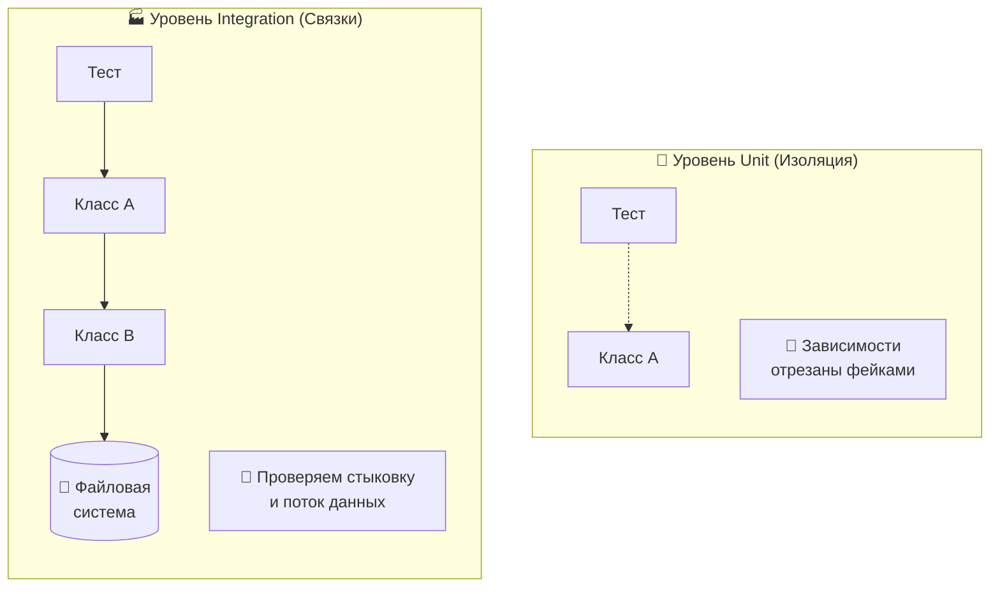
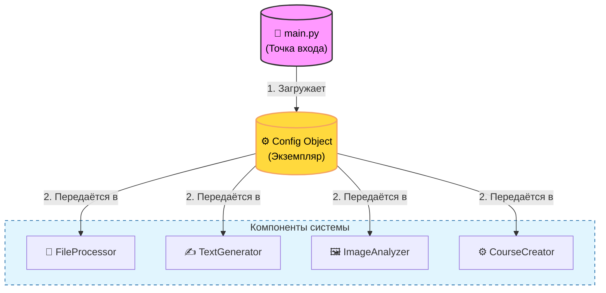
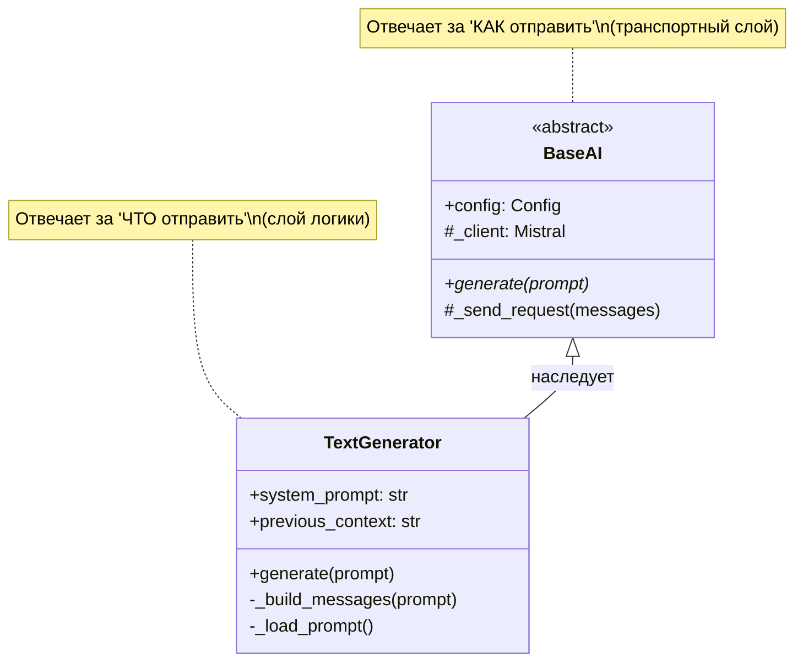
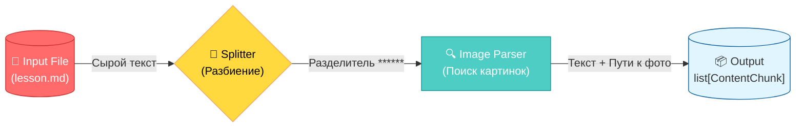
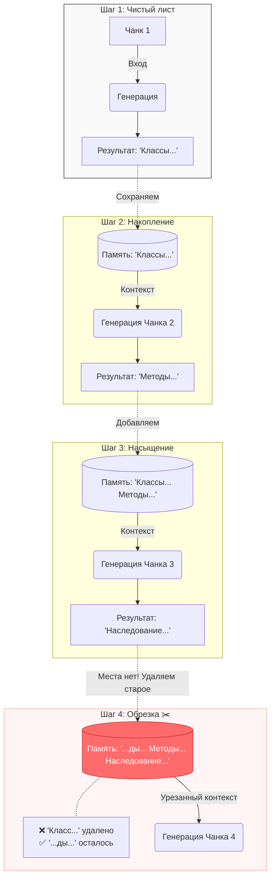
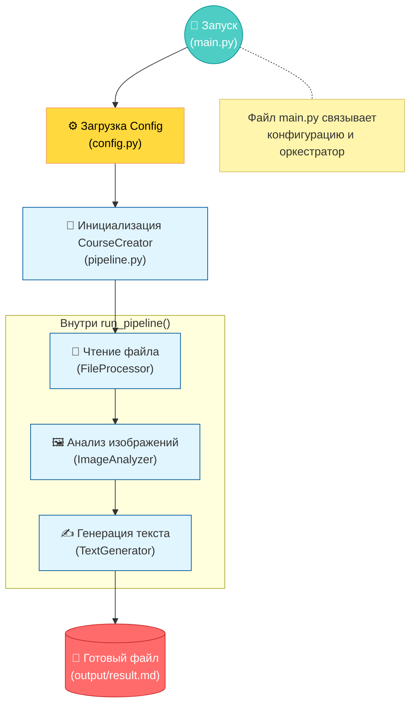

# Комплексные Mermaid диаграммы

## Диаграмма 1: Unit и Integration тесты

## Диаграмма 2: Компоненты системы

## Диаграмма 3: ClassDiagram

## Диаграмма 4: Pipeline обработки

## Диаграмма 5: Память и накопление

## Диаграмма 6: Полный Pipeline

