# 📊 Коллекция диаграмм Mermaid

Демонстрация различных типов диаграмм для тестирования.

## 🔄 Flowchart диаграммы

### Простой процесс принятия решений

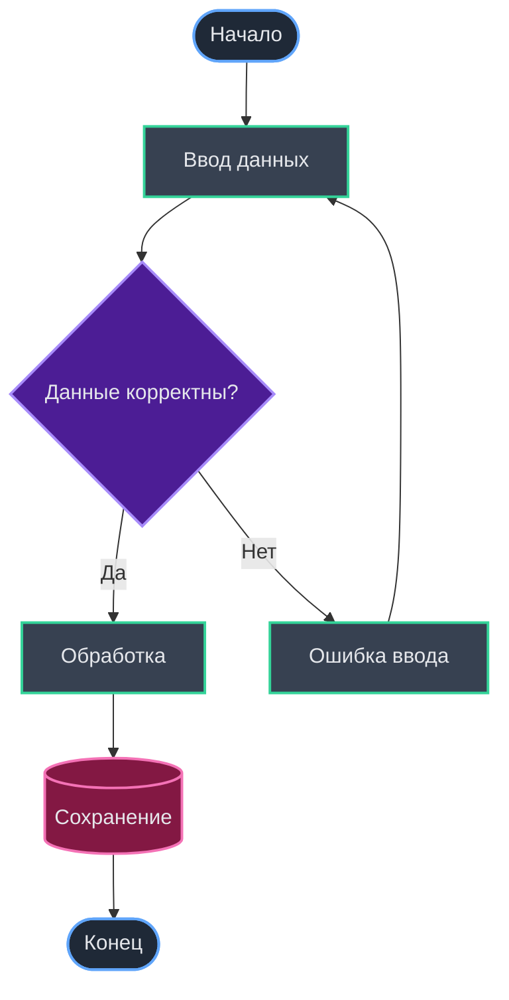

### Сложный бизнес-процесс

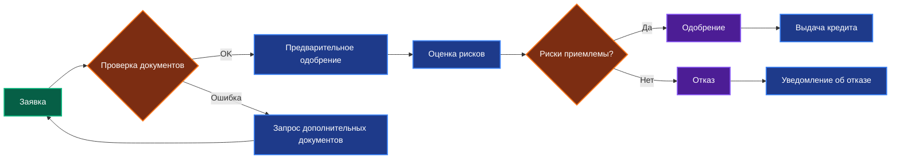

## 📈 Sequence диаграммы

### Процесс авторизации

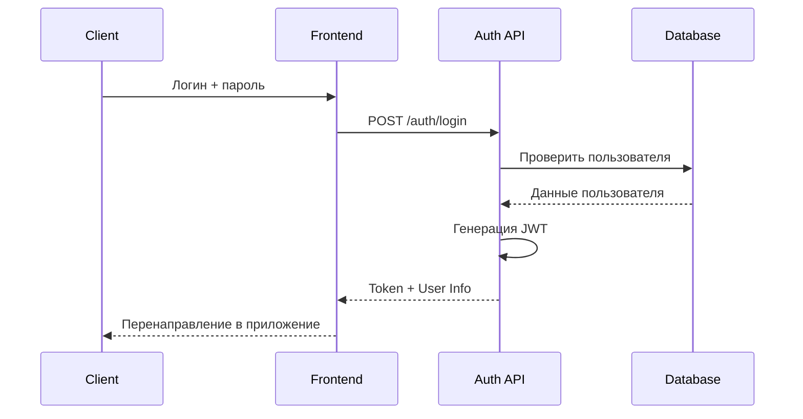

### Микросервисная архитектура

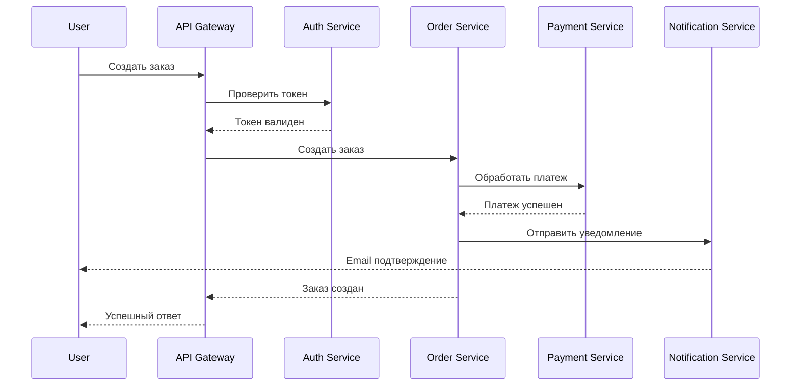

## 🗃️ ER диаграммы

### Система управления контентом

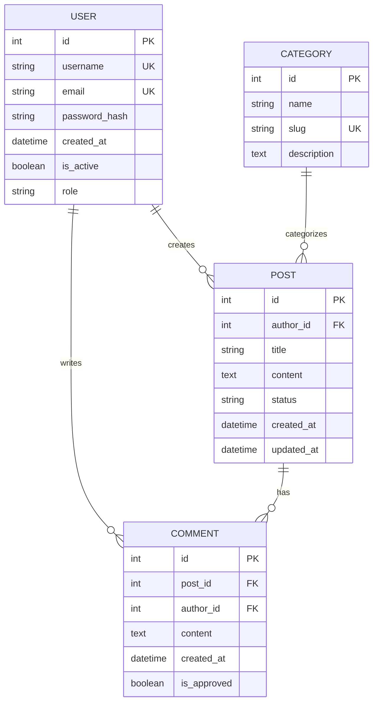

## 📊 Диаграммы состояний

### Жизненный цикл заказа

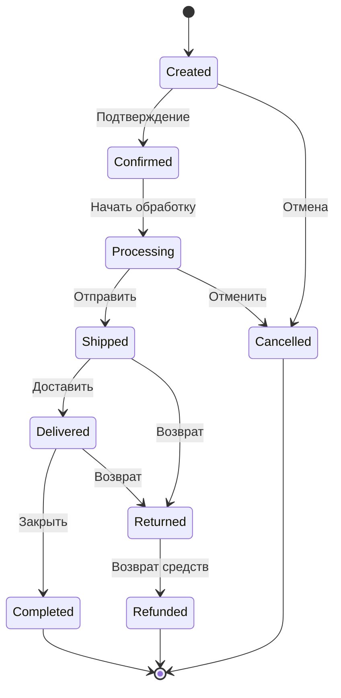

### Состояния пользователя

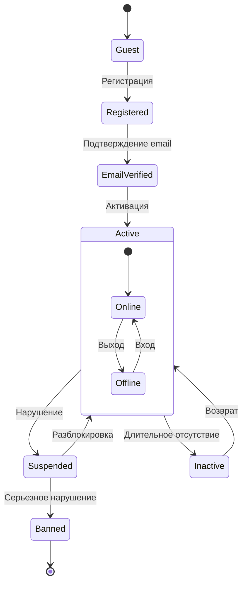

## 📅 Gantt диаграммы

### План разработки продукта

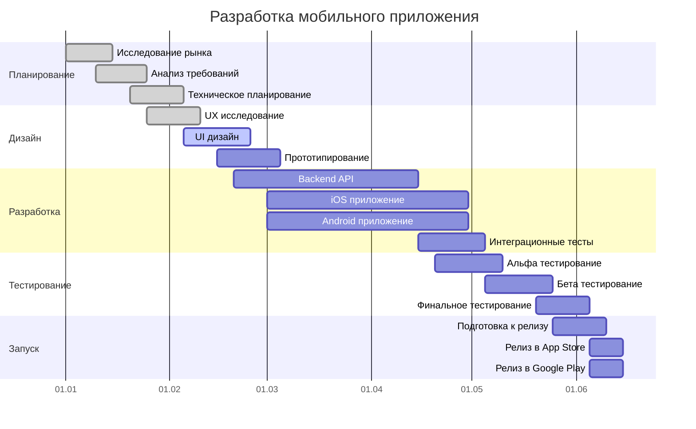

## 🚀 Git диаграммы

### Gitflow модель

```mermaid
gitgraph
    commit id: "Initial"
    branch develop
    checkout develop
    commit id: "Setup"
    
    branch feature
    checkout feature
    commit id: "Feature A"
    commit id: "Feature B"
    
    checkout develop
    merge feature
    commit id: "Merge feature"
    
    checkout main
    merge develop
    commit id: "Release v1.0"
    
    branch hotfix
    checkout hotfix
    commit id: "Hotfix"
    
    checkout main
    merge hotfix
    commit id: "v1.0.1"
```

## 🏗️ Архитектурные диаграммы

### Микросервисная архитектура

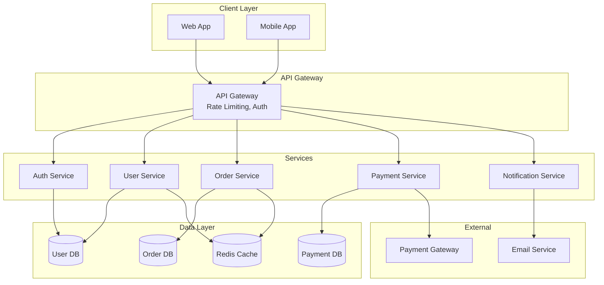

## 🔄 User Journey диаграмма

### Процесс покупки

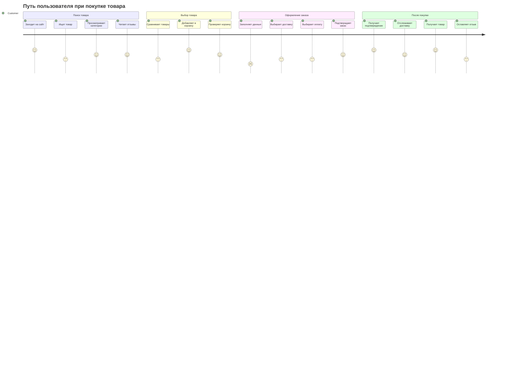

## 📊 Mindmap диаграмма

### Структура веб-приложения

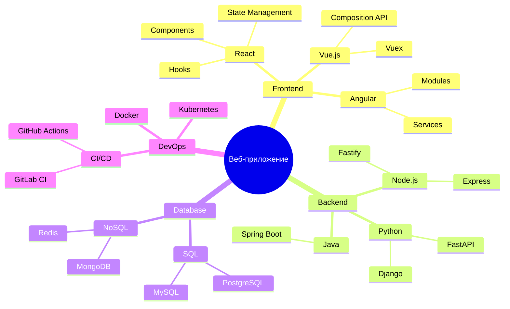

---

## ✅ Заключение

Эта коллекция демонстрирует все основные типы диаграмм Mermaid:

- **Flowchart** - блок-схемы и процессы
- **Sequence** - диаграммы последовательности
- **ER** - диаграммы сущность-связь
- **State** - диаграммы состояний  
- **Gantt** - временные диаграммы
- **Git** - схемы ветвления
- **Architecture** - архитектурные схемы
- **Journey** - пользовательские сценарии
- **Mindmap** - интеллект-карты

> [!tip]
> Используйте эти примеры как основу для создания собственных диаграмм!

## 📚 Class диаграмма

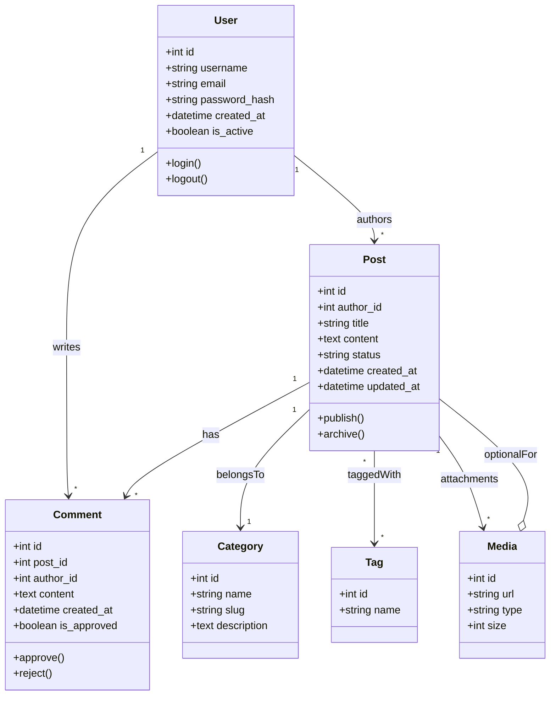
