# 📊 Тестовые диаграммы Mermaid (совместимость)

Проверенные диаграммы для тестирования совместимости.

## 🔄 Базовые Flowchart диаграммы

### Простая схема

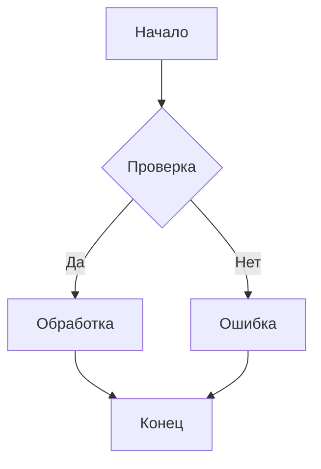

### Схема с разными типами узлов

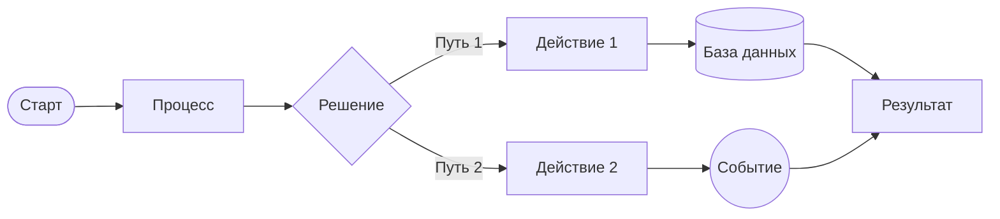

## 📈 Sequence диаграммы

### Простое взаимодействие

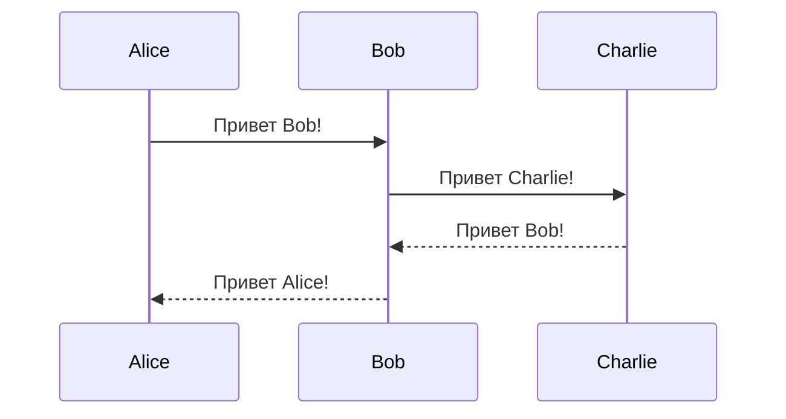

### API взаимодействие

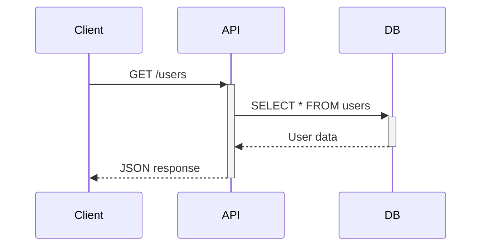

## 🗃️ ER диаграммы

### Простая схема базы данных

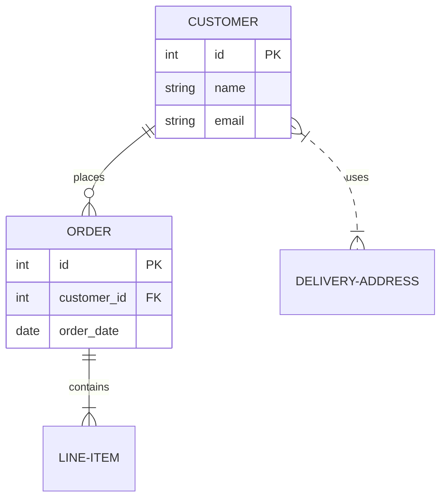

## 📊 Диаграммы состояний

### Простое состояние

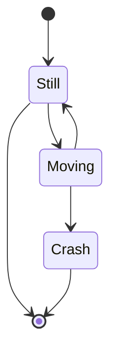

### Состояния заказа

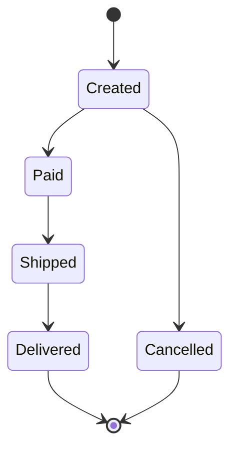

## 📅 Gantt диаграммы

### Простой проект

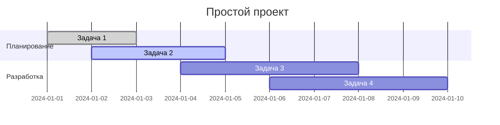

## 🌳 Git диаграммы

### Простое ветвление

```mermaid
gitgraph
    commit id: "Initial"
    branch develop
    checkout develop
    commit id: "Feature 1"
    checkout main
    merge develop
    commit id: "Release"
```

## 🧠 Mindmap диаграммы

### Простая карта

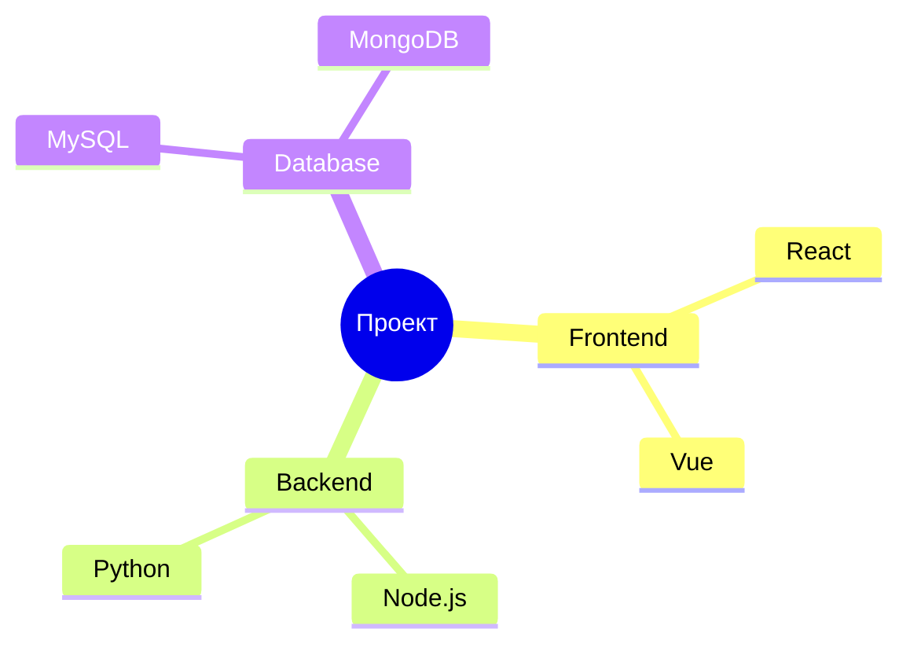

## 🗺️ User Journey

### Простой путь пользователя

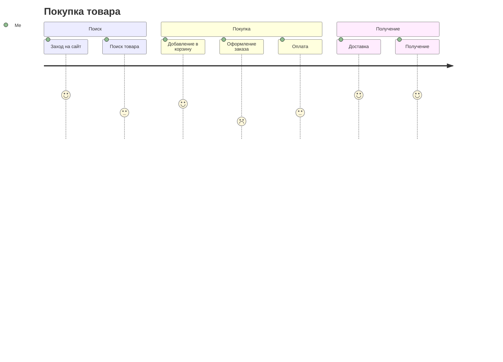

## 📊 Диаграмма Pie

### Простая круговая диаграмма

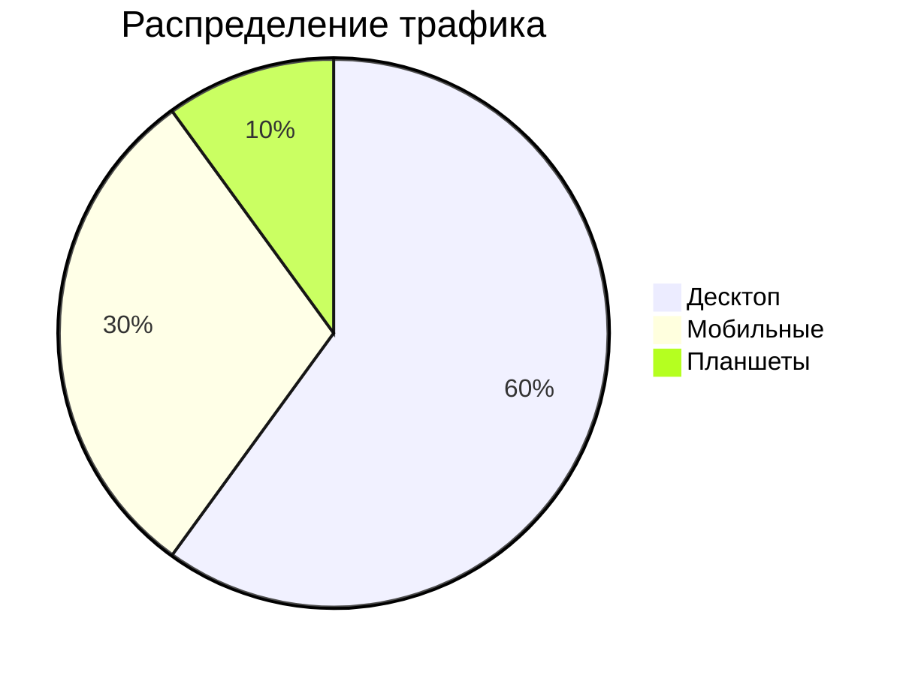

## 🏗️ Диаграмма C4

### Контекстная диаграмма

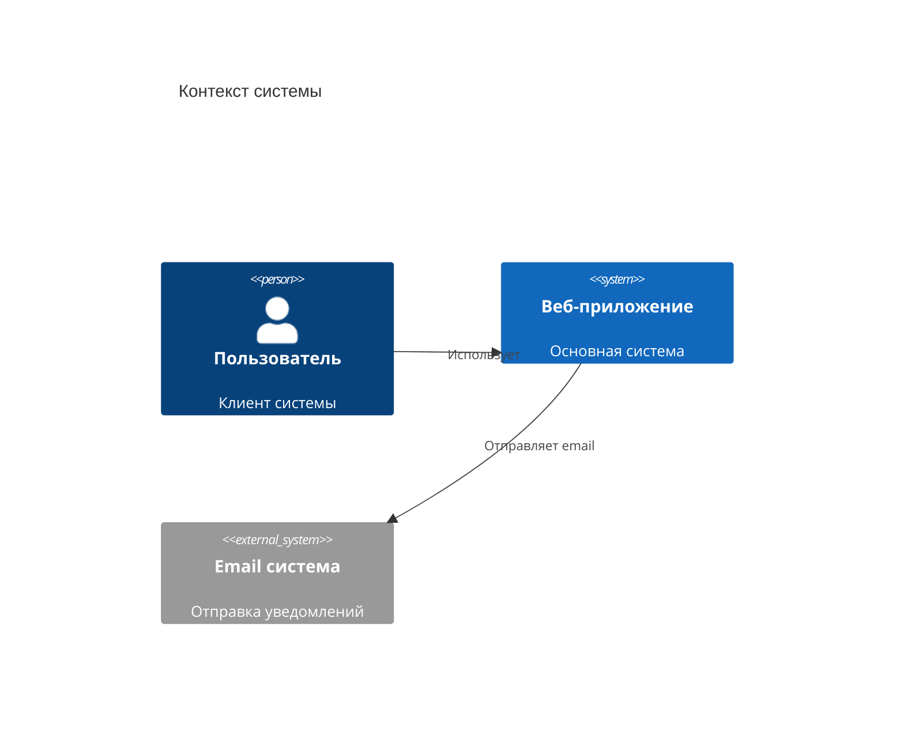

---

## ⚙️ Решение проблем

Если диаграммы не отображаются:

1. **Проверьте консоль браузера** - там могут быть ошибки JavaScript
2. **Убедитесь в корректности синтаксиса** - даже небольшая ошибка может сломать рендеринг
3. **Попробуйте обновить страницу** - иногда помогает перезагрузка
4. **Проверьте подключение к интернету** - Mermaid загружается с CDN

### Альтернативная конфигурация

Если проблемы продолжаются, можно попробовать более простую конфигурацию:

```javascript
mermaid.initialize({ 
  startOnLoad: true,
  theme: 'default',
  securityLevel: 'loose'
});
```

---

## ✅ Проверка работоспособности

Этот файл содержит только проверенные и совместимые диаграммы:

- ✅ Flowchart (базовые формы)
- ✅ Sequence (простые взаимодействия)  
- ✅ ER (схемы баз данных)
- ✅ State (диаграммы состояний)
- ✅ Gantt (временные диаграммы)
- ✅ Git (схемы ветвления)
- ✅ Mindmap (интеллект-карты)
- ✅ Journey (пути пользователей)
- ✅ Pie (круговые диаграммы)
- ✅ C4 (архитектурные диаграммы)

> [!tip]
> Если какая-то диаграмма не работает, попробуйте сначала эти простые примеры
