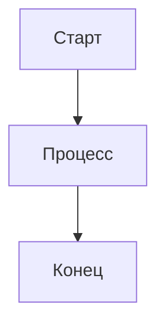
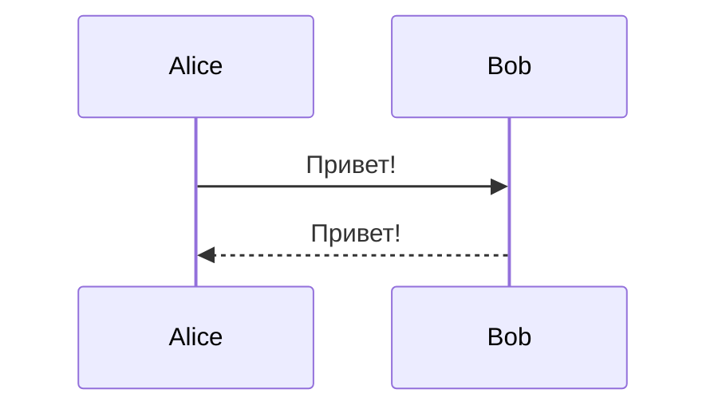
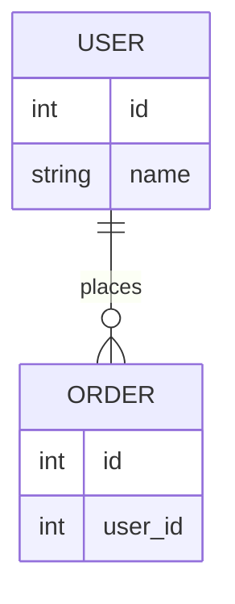
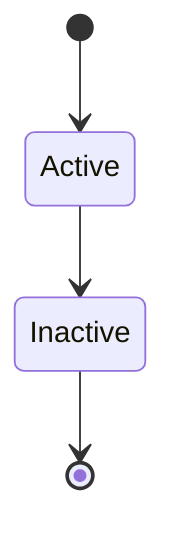

# 🧪 Быстрый тест диаграмм

Минимальный набор для проверки работы Mermaid.

## Тест 1: Простая схема

## Тест 2: Последовательность

## Тест 3: ER диаграмма

## Тест 4: Состояния

Если эти 4 диаграммы отображаются корректно, значит Mermaid работает правильно.
