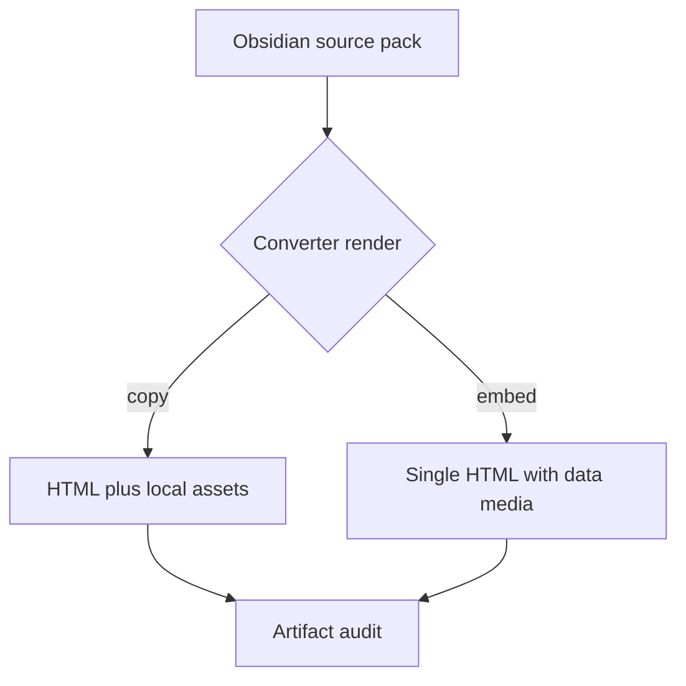

# Real Obsidian visual fixture

This is a clean source-pack fixture for the timecodes + callouts + media regression wave. It intentionally uses Obsidian-style embeds for the primary media path.

![[cover-01.webp|640]]

> [!NOTE] Source-pack contract
> Primary image, audio, and video surfaces below are written as real Obsidian embeds, not stale post-render HTML.
> The raw HTML media section is a separate parity/negative case and needs explicit artifact-audit accounting.

## Primary Obsidian media embeds

### Audio from real vault media

![[lm-studio-01-audio.opus]]

```timecodes
00:01 Audio intro from the real LM Studio opus asset
00:04 Audio later marker with escaped label <script>alert("x")</script>
```

### Generated local video via Obsidian embed

![[local-demo-video.mp4]]

```timecodes
00:01 Video intro marker
00:03 Video later marker
```

## Real vault screenshots

![[lm-studio-01-1.webp|720]]

> [!WARNING] Warning callout
> The fixture must be rendered from this source every run. If output media exists without converter evidence, treat it as stale QA evidence.

> [!QUESTION] Question callout
> Does copy mode contain every required local artifact relative to the HTML file?

> [!IMPORTANT] Important callout
> - Obsidian embeds should drive the normal path.
> - Raw HTML audio/video below is isolated as a parity/negative case.
> - The manifest maps every fixture file to its origin.

## Mermaid smoke



## Raw HTML parity / negative case

This section is intentionally not the primary fixture path. It demonstrates that raw HTML audio/video `src` values must be audited explicitly; if the converter does not package them automatically, the run log must say whether manual copy was needed.

<audio controls src="raw-html-parity/raw-local-tone.wav"></audio>

<video controls width="320" src="raw-html-parity/raw-local-video.mp4"></video>
