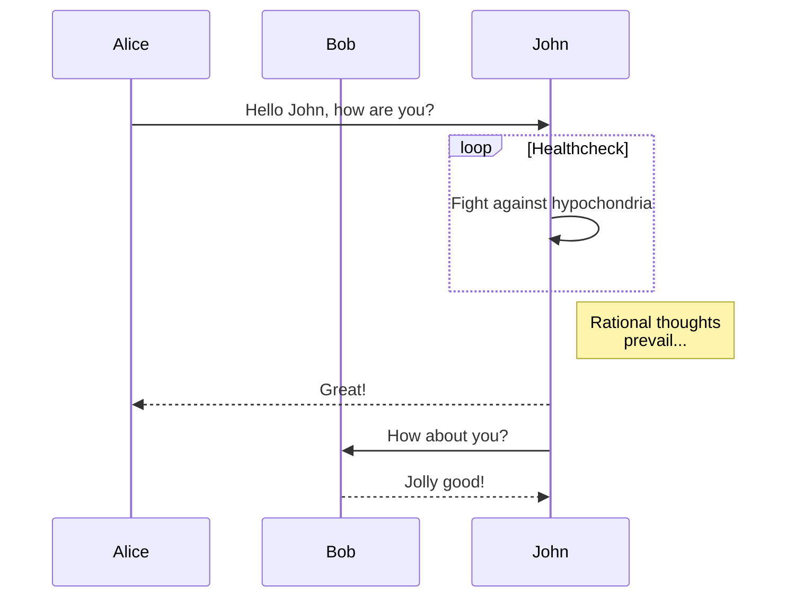
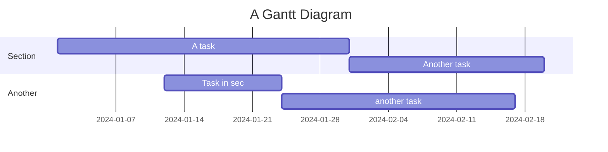

# Тестовый документ для проверки Mermaid

Это тестовый документ, чтобы убедиться, что диаграммы Mermaid и другая Markdown-разметка отображаются правильно.

## Простая диаграмма последовательности



## Диаграмма Ганта



## Блок с кодом на Python

```python
def hello_world():
    print("Hello, world!")

hello_world()
```

## Список

- Элемент 1
- Элемент 2
  - Вложенный элемент 2.1
  - Вложенный элемент 2.2
- Элемент 3

> [!info]
> Это информационный блок для проверки стилей.

Все готово для теста!