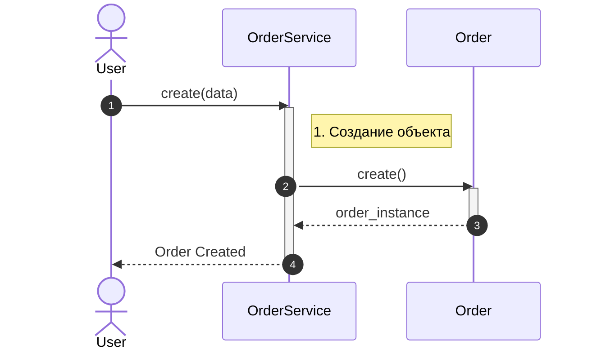
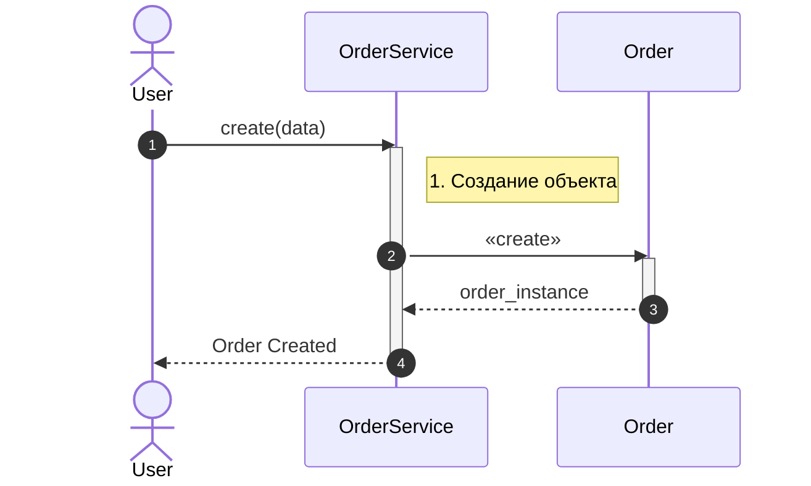

# Test: Alternative Syntax

## Вариант 1: Без << >>

```mermaid
sequenceDiagram
    autonumber
    actor User
    participant Service as OrderService
    participant Ord as Order

    User->>Service: create(data)
    activate Service
    
    Note right of Service: 1. Создание объекта
    Service->>Ord: create()
    activate Ord
    Ord-->>Service: order_instance
    deactivate Ord

    Service-->>User: Order Created
    deactivate Service
```

## Вариант 2: С юникод кавычками

```mermaid
sequenceDiagram
    autonumber
    actor User
    participant Service as OrderService  
    participant Ord as Order

    User->>Service: create(data)
    activate Service
    
    Note right of Service: 1. Создание объекта
    Service->>Ord: «create»
    activate Ord
    Ord-->>Service: order_instance
    deactivate Ord

    Service-->>User: Order Created
    deactivate Service
```
