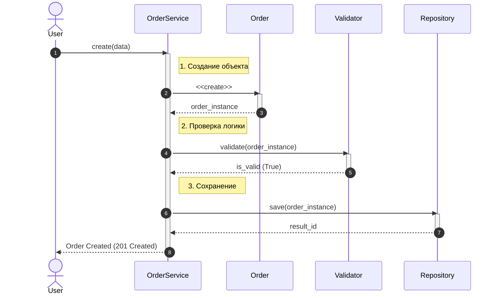
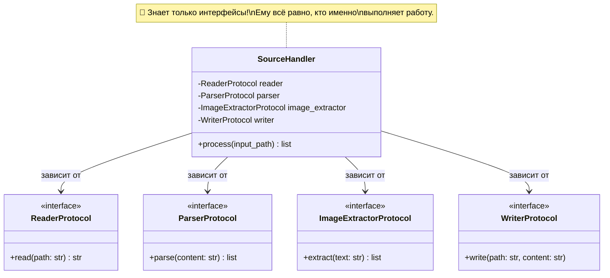

# Тест диаграмм Mermaid

## Sequence диаграмма

```mermaid
sequenceDiagram
    autonumber
    actor User
    participant Service as OrderService
    participant Ord as Order
    participant Val as Validator
    participant Repo as Repository

    User->>Service: create(data)
    activate Service
    
    Note right of Service: 1. Создание объекта
    Service->>Ord: <<create>>
    activate Ord
    Ord-->>Service: order_instance
    deactivate Ord

    Note right of Service: 2. Проверка логики
    Service->>Val: validate(order_instance)
    activate Val
    Val-->>Service: is_valid (True)
    deactivate Val

    Note right of Service: 3. Сохранение
    Service->>Repo: save(order_instance)
    activate Repo
    Repo-->>Service: result_id
    deactivate Repo

    Service-->>User: Order Created (201 Created)
    deactivate Service
```

## Class диаграмма

```mermaid
classDiagram
    class ReaderProtocol {
        <<interface>>
        +read(path: str) str
    }
    
    class ParserProtocol {
        <<interface>>
        +parse(content: str) list
    }
    
    class ImageExtractorProtocol {
        <<interface>>
        +extract(text: str) list
    }
    
    class WriterProtocol {
        <<interface>>
        +write(path: str, content: str)
    }
    
    class SourceHandler {
        -ReaderProtocol reader
        -ParserProtocol parser
        -ImageExtractorProtocol image_extractor
        -WriterProtocol writer
        +process(input_path) list
    }
    
    SourceHandler --> ReaderProtocol : зависит от
    SourceHandler --> ParserProtocol : зависит от
    SourceHandler --> ImageExtractorProtocol : зависит от
    SourceHandler --> WriterProtocol : зависит от
    
    note for SourceHandler "🎯 Знает только интерфейсы!\nЕму всё равно, кто именно\nвыполняет работу."
```
