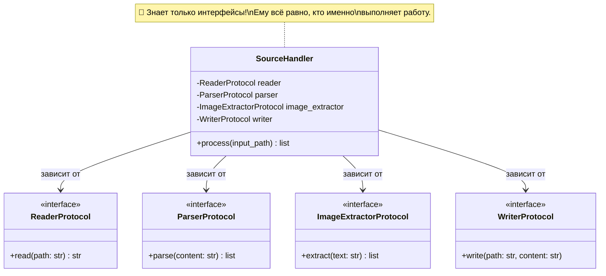

# Урок 108 - ОРИГИНАЛ от AI-писателя

```mermaid
classDiagram
    class ReaderProtocol {
        <<interface>>
        +read(path: str) str
    }
    
    class ParserProtocol {
        <<interface>>
        +parse(content: str) list
    }
    
    class ImageExtractorProtocol {
        <<interface>>
        +extract(text: str) list
    }
    
    class WriterProtocol {
        <<interface>>
        +write(path: str, content: str)
    }
    
    class SourceHandler {
        -ReaderProtocol reader
        -ParserProtocol parser
        -ImageExtractorProtocol image_extractor
        -WriterProtocol writer
        +process(input_path) list
    }
    
    SourceHandler --> ReaderProtocol : зависит от
    SourceHandler --> ParserProtocol : зависит от
    SourceHandler --> ImageExtractorProtocol : зависит от
    SourceHandler --> WriterProtocol : зависит от
    
    note for SourceHandler "🎯 Знает только интерфейсы!\nЕму всё равно, кто именно\nвыполняет работу."
```
