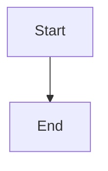
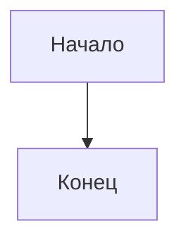
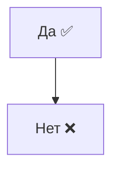
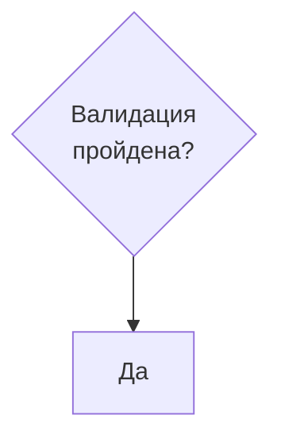
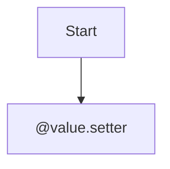
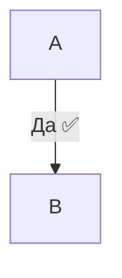
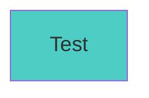
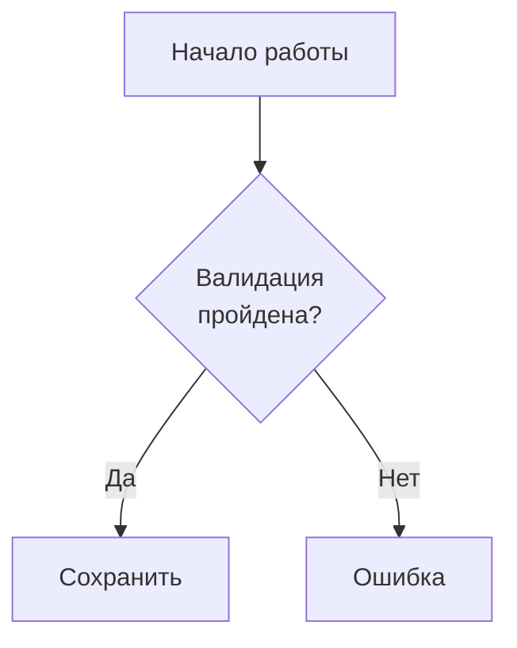

# Тест 1: Минимальная диаграмма

# Тест 2: С кириллицей

# Тест 3: С Unicode эмодзи (в кавычках)

# Тест 4: С br тегом

# Тест 5: С @ символом (проблемный!)

# Тест 6: Edge labels с Unicode

# Тест 7: classDef

# Тест 8: Комплексный (без @)

