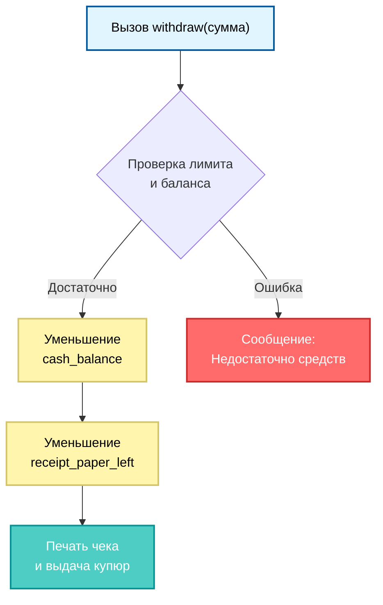

# Тест диаграммы withdraw

```mermaid
flowchart TD
    %% Узлы и логика
    A["Вызов withdraw(сумма)"]:::start --> B{"Проверка лимита<br/>и баланса"}
    
    B -->|Достаточно| C["Уменьшение<br/>cash_balance"]:::action
    B -->|Ошибка| F["Сообщение:<br/>Недостаточно средств"]:::error
    
    C --> D["Уменьшение<br/>receipt_paper_left"]:::action
    D --> E["Печать чека<br/>и выдача купюр"]:::result

    %% Стилизация
    %% Я переименовал класс call в start, чтобы избежать конфликта имен
    classDef start fill:#e1f5fe,stroke:#01579b,color:#000,stroke-width:2px
    classDef action fill:#fff5ad,stroke:#d4c46a,color:#000,stroke-width:2px
    classDef result fill:#4ecdc4,stroke:#0a9396,color:#fff,stroke-width:2px
    classDef error fill:#ff6b6b,stroke:#c92a2a,color:#fff,stroke-width:2px
```
